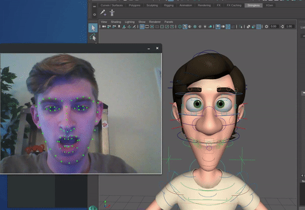

# Stringless



Stringless is a real-time, markerless, single-camera facial motion capture system. By using [dlib](http://dlib.net/) facial landmark detection, Stringless captures facial motion data and sends it to an Autodesk Maya plug-in, where a user can map the motion capture data to a rigged face model.

Currently Stringless is still a work in progress. I accept pull requests, and issues for bugs + feature requests are welcome.

While this project's initial prototype is still in development, all commits are to the master branch. Once I finish the initial prototype, I will switch into a more standard develop/patch/master branch style of version control.

## Build instructions

### Server

Stringless server requires [OpenCV](http://opencv.org/) and [dlib](http://dlib.net).

1. Clone a copy of Stringless:

    `$ git clone https://github.com/octop1/stringless.git`

2. Make a build directory and compile:

    ```
    $ cd stringless

    $ mkdir build

    $ cd build

    $ cmake .. -DUSE_AVX_INSTRUCTIONS=ON

    $ make
    ```

### Maya plug-in

The Maya plug-in requires the Maya API and a custom instance of Qt for Maya, both dependent on your version of Maya. Versions before 2016 have the custom Qt for Maya included in the installation, 2016 and above have it in separate dev-kits available for download, either on [GitHub](https://github.com/autodesk-adn/Maya-devkit) (version 2016) or on the [Autodesk App Store](https://apps.autodesk.com/) (versions 2016.5 and above).

Build instructions will be added in time - the dependencies have been fluctuating and the plug-in is too instable at this time.

## Running Stringless

To initiate the server process using the default camera (camera 0):

`$ src/Stringless -f ../ext/dlib/shape_predictor_68_face_landmarks.dat`

Use the `-cn=<arg>` flag to specify a different camera.

To start up the Maya plug-in:

1. Load up the Stringless plug-in, copy the MEL script
2. Enter `source StringlessMaya` into the MEL command line
3. Enter `createStringlessCap "<name>"` into the MEL command line

### Optimizing performance

Use the `-d`/`--dsr` flag to specify a downsample ratio. This scales down the captured image frames, speeding up face detection greatly.

*Example*: `./Stringless ... -d 2` will scale down the image by a half (1/**2**).

Use the `-s`/`--sr` flag to specify a sampling rate for face detection. By default Stringless attempts to detect faces in every frame, but if the actor is keeping their head fairly still during captures, the interval between sampled frames can be raised without any noticeable drop in capture quality.

*Example*: `./Stringless ... -s 3` will look for faces every three frames, and will use the face location data from the previously sampled frame to define the facial landmark detection region.

When compiling Stringless, it is important to use the `-DUSE_AVX_INSTRUCTIONS=ON` flag with cmake - this instructs your compiler to use especially optimized [Advanced Vector Extension](https://en.wikipedia.org/wiki/Advanced_Vector_Extensions) instructions, which came about in early 2011. If you're using a pre-2011 CPU, use the `-DUSE_SSE4_INSTRUCTIONS=ON` flag instead (the next best optimal instructions).

## Contents

```
/ext                3rd-party libraries and dependencies

/nbproject          Netbeans project files

/src                Stringless server source

/stringless-maya    Stringless Maya plug-in (unstable)
```

## Licensing

Stringless is released under the Boost Software License; its dependency licenses can be viewed in the `LICENSE` file.

## Author

[Justin Tennant](http://justintennant.me)
